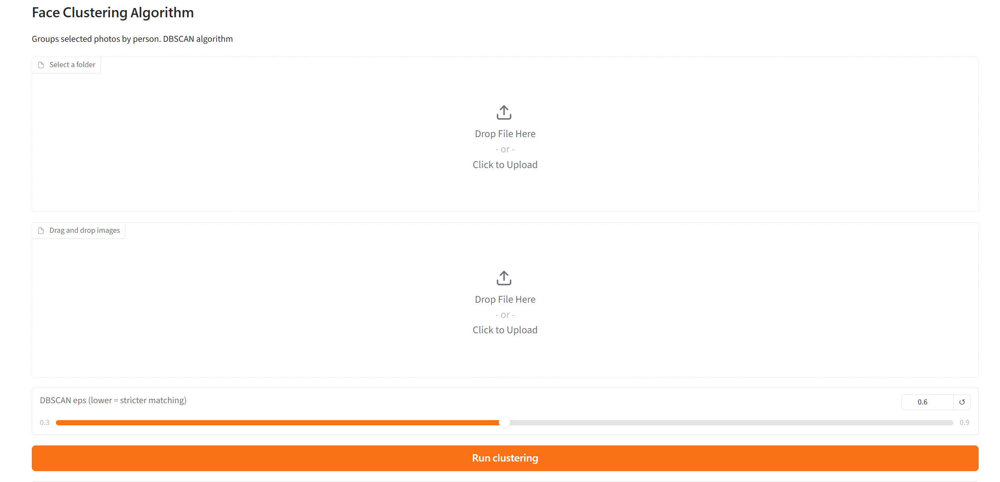

# Face Cluster

Face Cluster is a local Gradio app that groups photos by detected person. It uses InsightFace Buffalo-L to detect faces and create face embeddings, runs ONNX Runtime with CUDA GPU inference, and clusters similar faces with DBSCAN.

The app is intended for Windows users with NVIDIA GPUs.

## What it does

- Select a folder of images or drag and drop images directly in the Gradio UI.
- Detect every face found in the selected images.
- Generate normalized face embeddings with InsightFace Buffalo-L.
- Run inference through ONNX Runtime's `CUDAExecutionProvider`.
- Cluster similar faces with DBSCAN.
- Copy the original full photos into person folders under `output/`.

## GPU inference

This project is configured for CUDA GPU inference with:

- `onnxruntime-gpu==1.27.0`
- NVIDIA CUDA/cuDNN runtime packages from `pyproject.toml`
- `CUDAExecutionProvider`

`helper.py` adds NVIDIA DLL directories from Python site-packages before ONNX Runtime is imported. `main.py` then calls:

```python
ort.preload_dlls(directory="")
```

That makes ONNX Runtime load CUDA/cuDNN DLLs from the installed NVIDIA Python packages before InsightFace creates its inference sessions.

The project also excludes CPU-only `onnxruntime` in `pyproject.toml`:

```toml
[tool.uv]
exclude-dependencies = ["onnxruntime"]
```

This is important because `insightface` depends on plain `onnxruntime`, which can overwrite the GPU package's shared `onnxruntime` import if it is not excluded.

## Requirements

- Windows
- NVIDIA GPU
- Compatible NVIDIA driver
- Python `>=3.14`
- [`uv`](https://docs.astral.sh/uv/) for dependency management

The first run may download InsightFace model files into the user's local cache.

## Installation

Install `uv`, then clone the project:

```powershell
git clone <repo-url>
cd face-cluster
```

Install dependencies:

```powershell
uv sync
```

Check that ONNX Runtime can see CUDA:

```powershell
uv run python -c "import onnxruntime as ort; print(ort.get_available_providers())"
```

Expected output should include:

```text
CUDAExecutionProvider
```

## Run

Start the Gradio app:

```powershell
uv run python main.py
```

Open the local Gradio URL printed in the terminal.

## Using the app

You can provide images in either of two ways:

- Use **Select a folder** to upload a directory of images.
- Use **Drag and drop images** to upload one or more image files.

If neither input is provided, the app falls back to reading images from a local `photos/` folder.

Supported image extensions:

```text
.jpg, .jpeg, .png, .webp, .bmp, .tif, .tiff
```

The DBSCAN `eps` slider controls clustering strictness:

- Lower values are stricter and create more separate groups.
- Higher values are more lenient and may merge similar-looking people.

## Output behavior

Results are written to:

```text
output/
```

The app creates folders such as:

```text
output/person_0/
output/person_1/
output/unknown/
```

The app copies the original full photo into the matching folder. It does not crop faces.

If a photo contains multiple people, the same original photo can appear in multiple person folders. For example, a group photo containing two clustered people may be copied to both `person_0` and `person_1`.

Faces labeled `unknown` are DBSCAN noise points, usually faces without enough similar matches.

Each run clears previous generated person folders inside `output/`.

## Troubleshooting

### `CUDAExecutionProvider is not available`

Check that your environment is using the GPU runtime:

```powershell
uv run python -c "import onnxruntime as ort; print(ort.__version__); print(ort.get_available_providers())"
```

The provider list must include `CUDAExecutionProvider`.

If it only shows CPU providers, make sure:

- You installed dependencies with `uv sync`.
- `pyproject.toml` contains `[tool.uv] exclude-dependencies = ["onnxruntime"]`.
- `uv.lock` does not include plain `onnxruntime`.
- Your NVIDIA driver is installed and current enough for your GPU.

### `insightface` or ONNX Runtime falls back to CPU

The app checks each InsightFace model session after startup. If CUDA is not active, it raises an error instead of silently running on CPU.

### No faces found

Try images with clearer, larger, front-facing faces. Very small, blurry, side-profile, or occluded faces may not be detected.

### Output folders are missing

The `output/` folder is generated after a successful run. It is ignored by git because it contains local results.

## Project structure

```text
main.py          Gradio UI, CUDA provider setup, face embedding, clustering, output organization
helper.py        Adds NVIDIA DLL directories from installed Python packages
pyproject.toml   Project metadata, dependencies, and uv onnxruntime exclusion
uv.lock          Locked dependency versions
README.md        Project documentation
photos/          Optional local fallback input folder, ignored by git
output/          Generated clustering results, ignored by git
```

## Notes / current limitations

- CPU-only mode is not the normal documented path yet. `USE_GPU = True` currently fails loudly when CUDA is unavailable.
- The app organizes full original photos, not cropped face thumbnails.
- Person folder names are automatic cluster IDs, not real names.
- DBSCAN clustering quality depends on image quality, number of examples per person, and the selected `eps` value.
- The app is currently a local Gradio application, not a packaged desktop installer.
